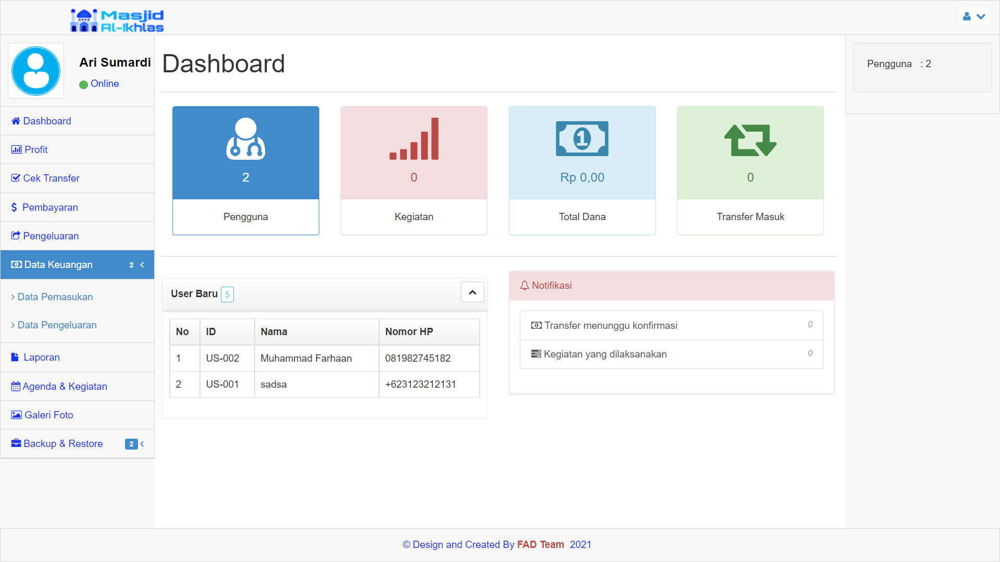
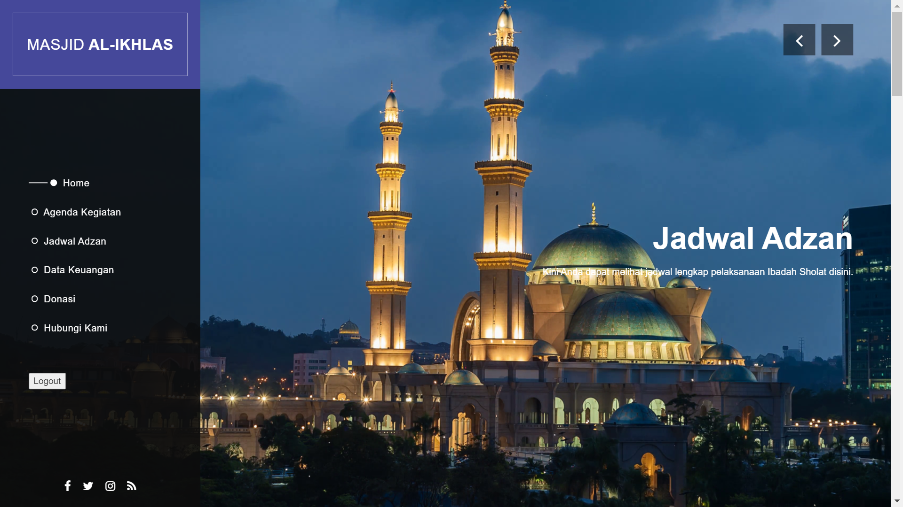

# Sistem Informasi dan Manajemen Masjid Al-Ikhlas
## Information
Sistem Informasi dan Manajemen Masjid Al-Ikhlas merupakan website yang berfungsi untuk mengelola semua informasi dan kegiatan yang ada di masjid. Seperti mengelola keuangan, donasi, uang masuk dan keluar, jadwal kegiatan, jadwal sholat dan lainnya. 
[Demo aplikasi](https://masjid.arisumardi.my.id/administrator.php)

## Screenshot 

## Prerequisites
* WAMPP/XAMPP Server
* PHP version 7++

## How To Use
* Clone or Download this repository
* Place the folder to /htdocs/
* Create database __db_masjid__ in phpmyadmin
* Import file __db_masjid.sql__ to your database
* Run project from your browser
